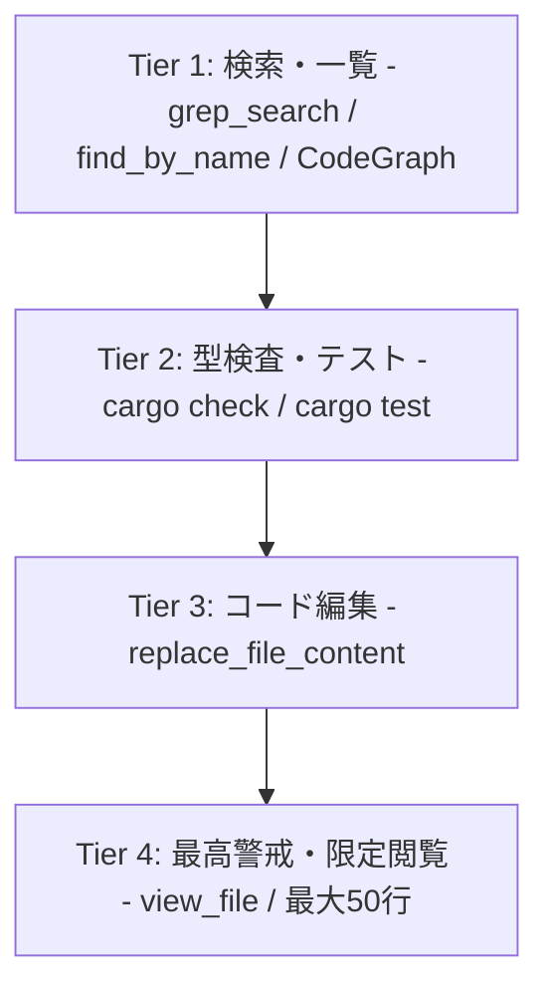

# OpenFallout3 Agent Guidelines & Mandates

本リポジトリは **Fallout 3 の基盤エンジン (Gamebryo 2.6)** を Rust でゼロから愚直に完全エミュレート移植するプロジェクトです。
過去の「推測による独自設計、エラー多発、トークン浪費、AIの逸脱、プロジェクト頓挫」を二度と繰り返さないため、作業にあたるすべての AI エージェントは以下の**絶対的ルール**を遵守しなければなりません。

---

## 1. 開発の基本鉄則（Mandates）

### Rule 1: オリジナル設計・推測による実装の絶対禁止 (Zero Speculation)
- 「こう動くはず」「現代的なゲームエンジンならこう設計する」といった推測やモダンエンジンのパラダイムを絶対に持ち込んではならない。
- すべてのデータ構造、フィールド名、ビットフラグ、親参照・子参照構造、更新順序は、**Gamebryo 2.6 の設計** および `references/nifxml/nif.xml` に定義された仕様に厳密に準拠すること。
- 未知のブロックや挙動に遭遇した場合は、コードを書く前に必ず調査し、文献・コードを特定すること。

### Rule 2: 一次文献・既存実装の参照と引用の義務付け (Evidence-Based Coding)
- 実装する構造体、列挙型、パース関数には、必ず根拠となるリファレンスを日本語 DOC コメントに明記すること。
  - 例: `/// 参照元: references/nifxml/nif.xml:L1234 (NiTriShapeData)`
  - 例: `/// 参照元: references/nifskope/src/spells/mesh.cpp, Gamebryo 2.6 NiAVObject::Update`
- 不明点がある場合は、以下の順序でローカルリファレンスを参照すること:
  1. `references/nifxml/nif.xml` (NIF のバイト構造バイブル)
  2. `references/nifskope/` (NifSkope C++ レンダリング・パース実装)
  3. `references/openmw/components/nif/` (OpenMW C++ 実装)

### Rule 3: トークン浪費防止と知識の永続化義務 (Knowledge-First Workflow)
- **Web 検索の禁止（ローカル優先）**: 外部 Web 検索ではなく、ローカルの `references/` ディレクトリを検索・ピンポイント参照して調査すること（トークン消費最小化・高速）。
- **知識ベース (`knowledge/`) への記録**:
  新しく調査・判明したブロック仕様、トランスフォーム計算式、シェーダーパラメータ、Gamebryo のクラス構造は、実装前に `knowledge/*.md` へ日本語で詳細にドキュメント化すること。

### Rule 4: DOC コメントの日本語義務
- すべての Rust ソースコードの doc コメント (`///`, `//!`) および内部説明コメントは、**必ず日本語で記述**すること。

---

## 2. ツール使用レベル体系 (Command Tier System)

エージェントによる「ファイル全体を無目的に連続で開き続けるループ (view_file ループ)」を根絶し、トークン浪費を防ぐため、以下の **4段階ツールレベル階層** を厳格に適用する。

### 【Tier 1: 探索・特定レベル】（優先度: 最高）
- **使用ツール**: `grep_search` (`MatchPerLine: true`), `find_by_name`, `CodeGraph MCP`
- **目的**: 関数定義、構造体定義、エラーメッセージ、呼び出し元箇所を行番号つきで一発抽出する。
- **原則**: ファイルを開く前に、必ずこのレベルで「ファイル名」と「該当行番号」を特定する。

### 【Tier 2: 型検査・検証レベル】（優先度: 高）
- **使用ツール**: `run_command` (`cargo check`, `cargo test`)
- **目的**: Rust コンパイラの厳格な型推論とテスト結果を IDE / MCP 代わりに最大限活用する。
- **原則**: 実装の前後で即座に実行し、エラー箇所の行番号と原因（型不一致、引数過不足）をコンパイラから直接受け取る。

### 【Tier 3: 変更・反映レベル】（優先度: 中）
- **使用ツール**: `replace_file_content`
- **目的**: コードの差分編集。
- **原則**: 編集箇所は前後 3 行のみを指定し、ファイル全体の無駄な置換を行わない。

### 【Tier 4: 最高警戒・限定閲覧レベル】（使用制限: 極小）
- **使用ツール**: `view_file`
- **制限事項**:
  1. **連続呼び出しの絶対禁止**: 同一ターン内で 2 回以上連続して `view_file` を呼んではならない。
  2. **範囲指定の義務**: 必ず `StartLine` と `EndLine` を指定し、**1 回の閲覧は最大 50 行以内** に絞ること。
  3. **事前条件**: Tier 1 (`grep_search`) で行番号が確定していない状態での盲目的閲覧は禁止。
  4. **自己停止ルール**: 調査目的が達せられたら、ファイルを眺め続けるのを即座に停止し、Tier 3（編集）または Tier 2（テスト）へ直行すること。

---

## 3. ファイルサイズ制約 & リファクタリング義務 (1,000 Line Limit)

保守性低下とコンテキスト肥大化を防ぐため、リポジトリ内のすべてのファイルに以下の厳格な制限を課す。

1. **1,000行上限ルール**:
   - 単一の Rust ソースファイル (`.rs`) が **1,000行** を超えた場合、いかなる新機能追加よりも優先して **機能別サブモジュールへの分割・リファクタリング** を実施しなければならない。
2. **専用スキルの発動**:
   - 1,000行を超過したファイルを発見した場合は、必ずスキル `refactor-large-file` を発動し、Gamebryo 2.6 の責務に準拠したモジュール分割を行うこと。
   - 分割後の各サブモジュールは 800行以下（最大でも 1,000行未満）に収めること。
3. **公開 API・テストの完全互換**:
   - モジュール分割時、既存の公開 API や構造体名・関数名を維持し、`cargo test --workspace` を 100% 通過させること。

---

## 4. MCP (Model Context Protocol) 運用の原則

本開発環境では、外部ツールや記憶領域として以下の MCP を適切に使い分けること。

1. **Memory MCP (Task / Issue / Decision 特化)**:
   - **記録すべきもの**:
     - `active_task`: 現在着手している具体的なブロックやクレート名
     - `blocked_issues`: 仕様不明や保留中の項目（どの文献が足りないか等）
     - `architectural_decisions`: なぜその設計・実装にしたかの根拠と決定事項
   - **記録禁止**: ソースコード断片や関数一覧のキャッシュ（陈腐化・トークン浪費防止）。
2. **CodeGraph MCP / Rust-Analyzer MCP**:
   - シンボルジャンプ、関数呼び出しツリーの検索、モジュール構造の解析に活用。
3. **MCP 不通時の代替フォールバック**:
   - MCP が一時的にエラーを返した場合は、決して `view_file` 乱用に逃げず、Tier 1 の `grep_search` と Tier 2 の `cargo check` にフォールバックすること。

---

## 5. 必須スキル (Required Skills)

作業開始時、以下のスキルを適宜参照・実行すること:
- `lookup-nif-spec`: `references/nifxml/nif.xml` および NifSkope からの仕様抽出。
- `verify-gamebryo-conformance`: Gamebryo 2.6 アーキテクチャ適合性検証。
- `refactor-large-file`: 1,000行超大容量ファイルのモジュール分割・リファクタリング。
