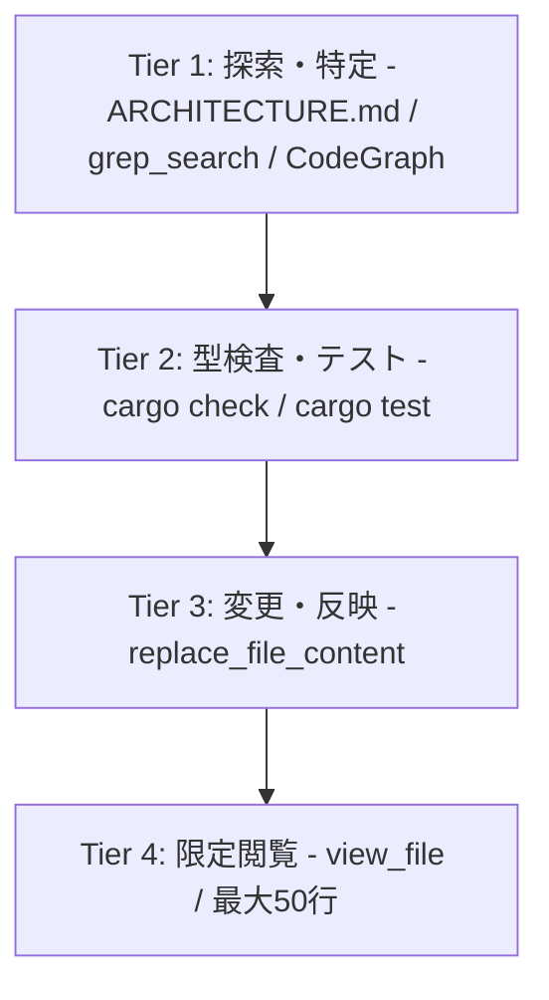

# OpenFallout3 エージェント開発規範 (Agent Guidelines & Mandates)

本リポジトリは **Fallout 3 の基盤エンジン (Gamebryo 2.6)** を Rust でゼロから愚直に完全エミュレート移植するプロジェクトです。
推測による独自設計、モックの混入、トークン浪費、AIの迷走を防ぐため、すべてのエージェントは以下の絶対規範を遵守してください。

---

## 1. 開発の基本鉄則 (Core Mandates)

- **Rule 1: オリジナル設計・推測による実装の絶対禁止 (Zero Speculation)**
  Gamebryo 2.6 の設計および `references/nifxml/nif.xml` の仕様に厳密準拠。「現代的な設計」等の自己流アレンジを禁止。
- **Rule 2: 一次文献・既存実装の参照と引用義務 (Evidence-Based)**
  構造体・関数・定数には根拠リファレンスを日本語 DOC コメントに明記。
  優先順: (1) `references/nifxml/nif.xml`, (2) `references/nifskope/`, (3) `references/openmw/`
- **Rule 3: エンジン層へのゲームデータ・モックのハードコード絶対禁止 (No Hardcoding)**
  `fo3_viewer`, `fo3_render`, `fo3_script` 等のエンジンコード内に、特定クエスト名 (`CG00` 等) や Edid/FormID の特別扱い if 文を混入させることを厳禁。エンジンは常にデータ駆動 (Data-Driven) で動作すること。
- **Rule 4: DOC コメント・内部説明の日本語義務**
  すべての Rust コードの doc コメント (`///`, `//!`) および内部解説は日本語で記述。
- **Rule 5: ARCHITECTURE.md 参照ファースト (Architecture-First Lookup)**
  コード調査時は、まずルートの `ARCHITECTURE.md` を確認して該当クレート・ファイルをピンポイント特定し、無目的な広域探索を行わない。

---

## 2. ファイルサイズ制約: 全ファイル 400行上限 (400-Line Limit)

コンテキスト肥大化とセッション枯渇（トークン浪費）を防ぐため、以下の制約を厳格に適用します：

1. **400行上限**: 単一の Rust ソースファイル (`.rs`) は **最大 400行以下（理想 200〜300行）** に維持する。
2. **サブモジュール分割義務**: 400行を超過したファイルを発見した場合は、新機能追加よりも優先して単一責務のサブモジュールへ分割する。
3. **API完全互換**: モジュール分割時は既存の公開 API・テストとの 100% 互換を維持する。

---

## 3. ツール使用レベル体系 (Command Tier System)

セッション割り当て消費を最小化するため、以下の順序を遵守すること：

- **Tier 1 (探索・特定)**: `ARCHITECTURE.md` を確認後、`grep_search` (`MatchPerLine: true`) でファイル名と行番号を一発特定。
- **Tier 2 (検証)**: `cargo check` / `cargo test` を即座に実行し、コンパイラ駆動でエラー箇所の行番号を受け取る。
- **Tier 3 (差分編集)**: `replace_file_content` で前後 3 行のみを指定して編集。
- **Tier 4 (限定閲覧 - 最高警戒)**: `view_file` は 1 回最大 50 行以内、同一ターン内の連続呼び出し絶対禁止。

---

## 4. MCP & 知識ベース運用

1. **Memory MCP**: `active_task`, `blocked_issues`, `architectural_decisions` のみ記録（コード断片のキャッシュ禁止）。
2. **Web 検索の禁止**: 外部検索ではなくローカルの `references/` ディレクトリを参照。
3. **ワークスペース衛生**: ルートに一時スクリプトやバイナリを放置せず、作業完了後は即座に削除すること。
