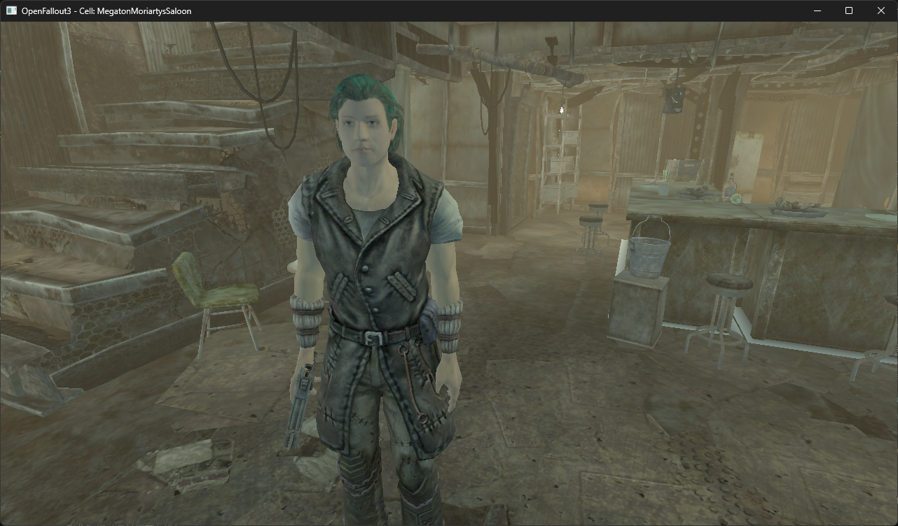
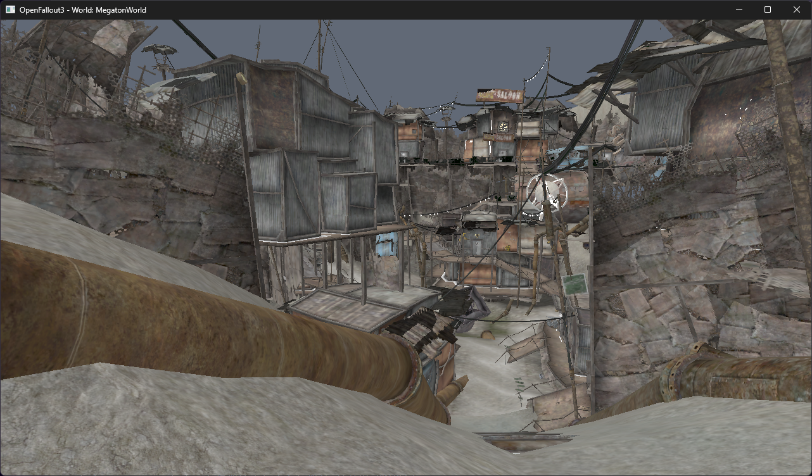
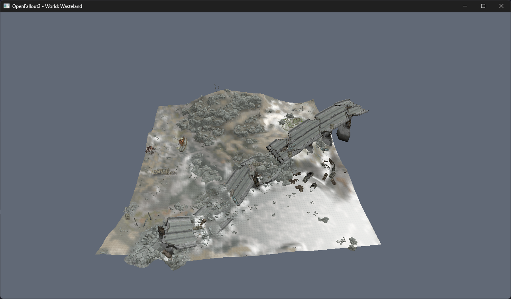
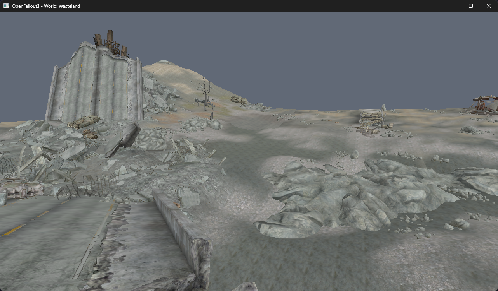
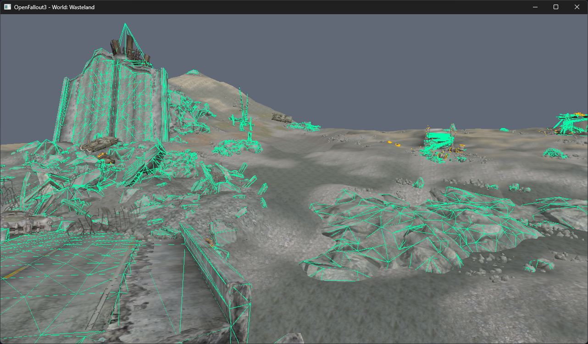

# OpenFallout3

<p align="center">
  
</p>

<p align="center">
  <strong>An open-source re-implementation and faithful emulation of the Fallout 3 (Gamebryo 2.6) engine from scratch in Rust</strong>
</p>

<p align="center">
  <a href="README.md">日本語</a> | <strong>English</strong>
</p>

<p align="center">
  <a href="LICENSE"></a>
  <a href="https://www.rust-lang.org/"></a>
  <a href="https://wgpu.rs/"></a>
  <a href="https://rapier.rs/"></a>
  <a href="AGENTS.md"></a>
  
</p>

---

## Overview

**OpenFallout3** is an open-source project aiming to faithfully reimplement the foundation engine of Bethesda Softworks' landmark RPG *Fallout 3* (Gamebryo 2.6) from scratch in Rust. The primary goal is to run the game natively, smoothly, and stably on modern operating systems and hardware architectures.

Inspired by initiatives such as OpenMW for *Morrowind*, OpenFallout3 reads original game asset formats directly (`Fallout3.esm`, `*.bsa`, `*.nif`, and `*.kf`). It reconstructs the entire rendering pipeline, bone skinning, rigid attachments, leveled item resolution, Havok physics, and real-time kinematic character controller on top of modern low-level graphics APIs via `wgpu`.

---

## Key Features & Architecture

### 1. Asset & Binary Parsers (`crates/fo3_*`)
- **fo3_esm**: Direct streaming parser for `Fallout3.esm`. Complete deserialization for `CELL`, `REFR`, `LAND`, `STAT`, `DOOR`, `LIGHT`, `NPC_`, `ARMO`, `HAIR`, and `LVLI` records.
- **Recursive Leveled Item (LVLI) Engine**: Breadth-First Search (BFS) resolver that recursively unfolds nested leveled lists (weapons, armors, ammo) down to concrete equipment items.
- **fo3_bsa**: High-speed hash index lookup and real-time zlib streaming decompression for Bethesda Archive v104 format.
- **fo3_vfs**: Virtual File System merging multiple BSA archives with loose files, transparently handling cross-platform case-sensitivity and separator differences.
- **fo3_nif**: Complete parser for Gamebryo 2.6 NIF (`v20.2.0.7`, `User Version 11`, `User Version 2 34`), including `NiNode`, `BSFadeNode`, `NiTriShape`, `NiTriStrips`, `NiAlphaProperty`, `bhkRigidBody`, `bhkPackedNiTriStripsShape`, `NiSkinInstance`, and `BSDismemberSkinInstance`.

<p align="center">
  
</p>

### 2. GPU Rendering Engine (`crates/fo3_render`, `crates/fo3_viewer`)
- **wgpu (Vulkan / DirectX 12 / Metal)**: High-performance, modern low-level graphics pipeline.
- **Material & Shader Pipeline**: Diffuse maps, normal maps (with tangent / bitangent generation), and glow/emissive maps.
- **Landscape Multi-Texturing**: Terrain splatting combining base textures (BTXT) and slope/elevation alpha blend layers (ATXT).
- **Gamebryo Rendering Sequence**: Strict separation of opaque passes (depth write enabled) and distance-sorted transparent passes (alpha blend / alpha test).
- **Environment & Lighting**: Reconstructs cell-specific directional sunlight, ambient lighting, volumetric fog, and placed point light sources (`LIGHT` records).

<p align="center">
  
</p>

### 3. Physics & Character Controller (`crates/fo3_physics`)
- **Havok Collision Translation**: Maps NIF Havok collision objects (Box, Sphere, Capsule, ConvexHull, TriMesh) and ESM `LAND` height grids into physics colliders.
- **Rigid Body Collisions & Debug Wireframes**: Full support for nested compound shapes. Live toggleable Havok wireframe overlay.
- **Kinematic Character Controller (KCC)**: Gravity, slope climbing, auto-stepping over stairs, ground detection, and sliding wall collision response.
- **Hybrid Camera**: One-key toggle between an orbital inspection camera and a first-person walkthrough mode.

<p align="center">
  
</p>

### 4. Actor, Skinning, Animation & Equipment System (`crates/fo3_render`, `crates/fo3_esm`)
- **NiSkinData / BSDismemberSkinInstance Skinning**: CPU bone skinning with vertex weight deformation, bind-pose inverse transforms, and auto-culling of dismemberment gore caps.
- **Gamebryo KF Keyframe Playback**: Bone pose evaluation supporting `NiTransformInterpolator` (linear / quaternion Slerp) and B-Spline interpolation (Cox-de Boor basis).
- **Bone Transform Overrides (`BoneTransformOverride`)**: Preserves rest-pose joint lengths for channels without keyframe translations, mathematically maintaining natural hand and finger spans (~9.8 units).
- **Full Multi-Part Actor Assembly**:
  - **Head**: Race-specific heads with rigid tracking (`Bip01 Head`) for eyeballs (left/right) and mouth parts (teeth, tongue).
  - **Armor & Clothing**: Automatic slot classification (Upper body, Head, Hands). Auto-hiding hair under full helmets and switching to cropped `Hat` geometry under hats.
  - **Hands**: Prioritizes glove NIFs when equipped, falling back to gender-specific bare hand meshes.
  - **Weapon Mounting**: Dynamically attaches rifles, pistols, and melee weapons to the `"Weapon"` bone (offset: X=49, Y=1.8, Z=81) on the right hand.
  - **Hair Tinting**: Accurate hair color rendering using `HCLR` records with natural fallback palette.

<p align="center">
  
</p>

---

## Major Updates & Changelog

| Date | Milestone & Changes | Core Components |
| :--- | :--- | :--- |
| **2026-09-12** | **Full Equipment Resolution Engine & Actor Visual Fixes**<br>・**Recursive Leveled Item (`LVLI`) Resolution**: Implemented nested BFS resolution, fixing all missing equipment (Vault 101 security armor/helmets/batons, Lucas Simms' hat/duster/Chinese Assault Rifle)<br>・**Havok Collision Filter**: Prevented `ColGroupInfo` strings from being mistaken as bone names, accurately mounting weapons to the right-hand `"Weapon"` bone<br>・**Rigid Uniform Initial Synchronization**: Corrected initial T-pose transform uniforms for hats, hair, and weapons<br>・**Finger Compression Fix (`BoneTransformOverride`)**: Preserved bind-pose translations for translation-free bones<br>・**Hair Color Fallback**: Natural palette fallback for NPCs without `HCLR` | `fo3_esm`<br>`fo3_render`<br>`fo3_viewer` |
| **2026-09-11** | **Phase 6-C: In-Cell NPC Auto-Assembly & Animation**<br>・Auto-detection of `ACHR` / `NPC_` records in interior/exterior cells; batch assembly of gender skeletons, bodies, heads, eyes, teeth, and hands<br>・Synchronized playback of idle animations (`ttnpchappysubtlelistena.kf`)<br>・Initial state culling for dismemberment gore caps | `fo3_render`<br>`fo3_viewer` |
| **2026-09-08** | **Phase 6-B: Keyframe Animation Player (`AnimationPlayer`)**<br>・`NiTransformInterpolator` (linear/Slerp) and B-Spline (Cox-de Boor basis) pose evaluation<br>・Hierarchical Forward Kinematics (FK) bone world recalculation pipeline | `fo3_render` |
| **2026-09-07** | **Phase 6-A: Skinning Engine & NIF Animation Block Parsers**<br>・Complete parsers for `NiSkinData`, `NiSkinPartition`, and `BSDismemberSkinInstance`<br>・Bind-pose inverse matrix transformations and CPU vertex blending | `fo3_nif`<br>`fo3_render` |
| **2026-09-05** | **Phase 5: Physics Simulation Integration (Rapier3D / KCC)**<br>・Rigid body conversion of NIF Havok shapes and ESM landscape height grids<br>・Real-time Kinematic Character Controller with gravity, slopes, stairs, and sliding collision response | `fo3_physics`<br>`fo3_viewer` |
| **2026-09-03** | **Phase 4: ESM Spatial Reconstruction & Multi-Cell Streaming**<br>・Direct streaming of `Fallout3.esm` to reconstruct CELL / REFR / LAND / STAT / DOOR / LIGHT positions<br>・Multi-cell exterior streaming for Megaton and Capital Wasteland | `fo3_esm`<br>`fo3_viewer` |
| **2026-09-01** | **Phase 1–3: File Foundation, NIF Geometry, & wgpu Rendering**<br>・BSA v104 decompression, Virtual File System (VFS)<br>・NIF geometry parsing, normal mapping, alpha sorting, and terrain texture splatting | `fo3_bsa`<br>`fo3_vfs`<br>`fo3_nif`<br>`fo3_render` |

---

## Workspace Architecture

```
OpenFallout3/
├── crates/
│   ├── fo3_gamebryo_core/  # Gamebryo 2.6 primitives, math, transforms
│   ├── fo3_esm/            # ESM/ESP master file parser with recursive LVLI resolution
│   ├── fo3_bsa/            # BSA archive reader (v104, zlib decompression)
│   ├── fo3_vfs/            # Virtual File System (VFS)
│   ├── fo3_nif/            # NIF geometry & Havok collision block parser
│   ├── fo3_physics/        # Physics simulation (Rapier3D / KCC character controller)
│   ├── fo3_render/         # wgpu rendering pipeline, scene graph, skinning, animation
│   └── fo3_viewer/         # Interactive 3D cell / world / actor viewer
├── docs/                   # Screenshots & technical documentation
├── knowledge/              # Reverse-engineered binary specifications & Gamebryo notes
└── references/             # Primary literature (nif.xml, NifSkope, OpenMW C++ source)
```

---

## Prerequisites & Building

### Requirements
- **Rust**: 1.80+ (latest stable toolchain recommended)
- **Fallout 3**: A legitimate installation of Fallout 3 via Steam or GOG (`Fallout3.esm` and `Data/*.bsa`)
- **GPU**: Graphics environment supporting Vulkan 1.2, DirectX 12, or Metal

### Build
```bash
git clone https://github.com/sofia-gros/OpenFallout3.git
cd OpenFallout3
cargo build --release
```

### Run All Unit Tests (44/44 passing)
```bash
cargo test --workspace
```

---

## Viewer Usage

Use `fo3_viewer` to explore interior cells, exterior world spaces, character actors, or raw NIF meshes.

### 1. Interior Cells
Loads all NPCs, lights, doors, static objects, and collision meshes in the specified cell.

```bash
# Vault 101 Entrance (fully assembled security officers with helmets, armor, batons)
cargo run --release -p fo3_viewer -- cell "A:\SteamLibrary\steamapps\common\Fallout 3 goty\Data" "Vault101a"

# Megaton Moriarty's Saloon (Colin Moriarty, Gob, Nova with clothing and hair)
cargo run --release -p fo3_viewer -- cell "A:\SteamLibrary\steamapps\common\Fallout 3 goty\Data" "MegatonMoriartysSaloon"

# Springvale Elementary School
cargo run --release -p fo3_viewer -- cell "A:\SteamLibrary\steamapps\common\Fallout 3 goty\Data" "SpringvaleSchool01"
```

### 2. World Spaces
Explores terrain, structures, and placed NPCs in Megaton or the Capital Wasteland.

```bash
# Megaton (Sheriff Lucas Simms wearing hat, duster, and Chinese Assault Rifle)
cargo run --release -p fo3_viewer -- world "A:\SteamLibrary\steamapps\common\Fallout 3 goty\Data" "MegatonWorld"

# Capital Wasteland (Wasteland)
cargo run --release -p fo3_viewer -- world "A:\SteamLibrary\steamapps\common\Fallout 3 goty\Data" "Wasteland" -1 2

# Washington D.C. Ruins (DCWorld01)
cargo run --release -p fo3_viewer -- world "A:\SteamLibrary\steamapps\common\Fallout 3 goty\Data" "DCWorld01"
```

### 3. Full Actor Assembly & Animation (Actor)
```bash
# Wasteland clothing + idle animation (head, eyes, mouth, hands, and fingers fully linked)
cargo run --release -p fo3_viewer -- actor "A:\SteamLibrary\steamapps\common\Fallout 3 goty\Data" "meshes\armor\wastelandclothing01\outfitm.nif" "meshes\characters\_male\idleanims\ttnpchappysubtlelistena.kf"
```

### 4. Single NIF Mesh Inspection
```bash
cargo run --release -p fo3_viewer -- "A:\SteamLibrary\steamapps\common\Fallout 3 goty\Data" "meshes\weapons\1handpistol\10mmpistol.nif"
```

---

## Controls

| Key / Mouse | Action |
| :--- | :--- |
| **Tab / M** | Toggle camera mode (Orbital orbit ⇔ First-person walkthrough) |
| **W / A / S / D** | Move Forward / Left / Backward / Right (in walkthrough mode) |
| **Space** | Jump / Ascend (in walkthrough mode) |
| **Mouse Move** | Look rotation |
| **Left Click + Drag** | Orbit camera rotation |
| **Right Click + Drag** | Pan camera |
| **Mouse Wheel** | Zoom in / out |
| **C** | Toggle Havok collision wireframe overlay (Collision ON/OFF) |
| **F** | Toggle cell environment fog (Fog ON/OFF) |
| **L** | Toggle viewer headlight (Light ON/OFF) |
| **R** | Refocus camera target |
| **Esc** | Exit viewer |

---

## Roadmap

| Phase | Description | Status |
| :--- | :--- | :--- |
| **Phase 1: File Foundation** | BSA v104 decompression, Virtual File System (VFS) | **Complete** |
| **Phase 2: 3D Mesh Parsing** | Gamebryo 2.6 NIF core nodes, geometry, and materials | **Complete** |
| **Phase 3: Rendering** | wgpu, normal maps, specular, alpha sorting, terrain splatting | **Complete** |
| **Phase 4: ESM Spatial Reconstruction** | CELL, REFR, STAT, LAND, and LIGHT spatial placement | **Complete** |
| **Phase 5: Collision & Physics** | Havok collision conversion, Rapier3D integration, real-time KCC | **Complete** |
| **Phase 6-A/B: Skinning & Animation** | NiSkinData skinning, KF interpolation, multi-part actor assembly | **Complete** |
| **Phase 6-C: In-Cell NPC Assembly & Equipment** | In-cell NPC placement, recursive LVLI resolution, hats, weapons, and outfits | **Complete** |
| **Phase 6-D: GPU Skinning** | Vertex shader bone palette skinning for performance optimization | Planned |
| **Phase 7: Interaction** | Door teleportation (XTEL), containers, activators | Planned |
| **Phase 8: Character & Camera** | Player actor, first/third-person models, state machines | Planned |
| **Phase 9: Script VM & Dialogue** | SCPT bytecode virtual machine, dialogue (DIAL/INFO) UI | Planned |

---

## Disclaimer

- This software is an open-source game engine recreation and contains no proprietary game assets from Fallout 3 (textures, meshes, sounds, ESM files, etc.). Users must supply their own legitimate Fallout 3 installation.
- This project is not affiliated with, endorsed by, or supported by Bethesda Softworks or ZeniMax Media.
- All trademarks and registered trademarks are the property of their respective owners.
