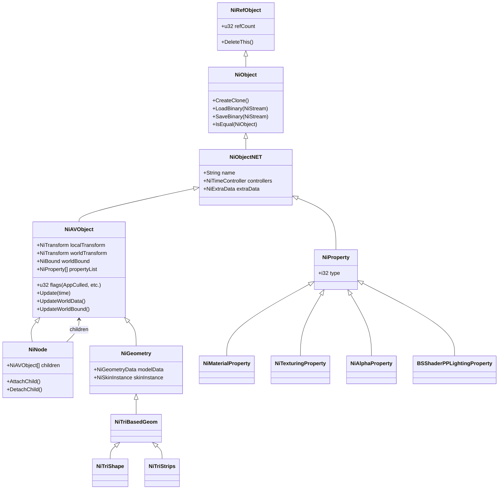

# Fallout 3 (Gamebryo 2.6) エンジン Rust 完全移植設計書

## 1. プロジェクト基本方針と哲学

### 1.1 目的
Fallout 3 の基盤である **Gamebryo 2.6 (NetImmerse 系統)** のデータ構造・シーングラフ・レンダリングパイプライン・アニメーションシステムを Rust でゼロから愚直に再構築（エミュレート移植）し、ゲーム全体が完全にオリジナル通りに動作する基盤を確立します。
（※物理エンジン Havok は後回しとし、まずは Gamebryo 本体のシーングラフ・描画・アセット・アニメーション・ワールド管理を完全再現します。また、将来的な他エンジンへの差し替えが可能なよう、コアと描画バックエンドの境界を整理します。）

### 1.2 移植の設計原則
1. **愚直な構造再現 (Faithful Structural Emulation)**:
   モダンエンジンの抽象化に最初から当てはめず、Gamebryo 2.6 のオブジェクト構造（`NiObject`、`NiAVObject`、`NiNode`、`NiProperty`、`NiTimeController`）の振る舞いをまず 1:1 でエミュレートする。
2. **Rust の所有権に最適化したアリーナ型シーングラフ**:
   Gamebryo C++ 特有の多重継承・循環参照・生ポインタ網（`NiPointer`）を、Rust の `Rc<RefCell<T>>` で再現すると借用パニックやリークが不可避となる。そのため、**インデックスベースのアリーナ（SlotMap / Generational Arena）**を採用し、安全かつ高速なシーングラフ・トラバーサルを実現する。
3. **将来的エンジン換装を見据えたレイヤー分離**:
   - `Core / SceneGraph`（純粋な Gamebryo 状態機械・シーングラフ・トランスフォーム階層）
   - `Asset / Stream`（NIF / BSA / ESM のバイナリデシリアライザ）
   - `Render Hardware Abstraction`（wgpu を用いた Direct3D 9 相当パイプラインのエミュレーション）

---

## 2. Gamebryo 2.6 のコアアーキテクチャ解析

### 2.1 クラス階層とオブジェクトモデル



### 2.2 Fallout 3 における特有の拡張（Bethesda 拡張ノード）
Fallout 3 は標準の Gamebryo 2.6 に対し、Bethesda Softworks 独自のノード（`BS` プレフィックス）を追加しています。これらも完全に再現します:
- **`BSShaderPPLightingProperty`**:
  Fallout 3 のマテリアルの大半を占めるピクセル単位ライティング用プロパティ。ディフューズ、法線マップ、スペキュラ、環境マップ、グローマップのテクスチャセットを管理。
- **`BSFadeNode`**:
  プレイヤーとの距離に応じて自動的にアルファブレンドフェード、または描画カリングを行う最適化ノード。
- **`BSOrderedNode`**:
  半透明オブジェクト描画順序（Sorting）を明示的に固定するためのノード。
- **`NiBSBoneLODController` / `BSAnimGroupSequence`**:
  スケルトン LOD およびアニメーションシーケンス管理。

---

## 3. Rust での Gamebryo 2.6 実装アーキテクチャ

Crates 構成を以下のように分離し、責務を明確にします。

```
OpenFallout3/
├── crates/
│   ├── fo3_gamebryo_core/     # Layer 0: RTTI, 数学 (Transform/Matrix/Bound), オブジェクト基本型
│   ├── fo3_gamebryo_scene/    # Layer 1: アリーナ型シーングラフ, NiNode, NiAVObject, トランスフォーム更新
│   ├── fo3_gamebryo_prop/     # Layer 2: プロパティシステム (Material, Alpha, Texturing, BSShader)
│   ├── fo3_gamebryo_anim/     # Layer 3: アニメーションコントローラー (NiTimeController, Keyframe)
│   ├── fo3_nif/               # Layer 4: NIF (v20.2.0.7) / NiStream デシリアライザ
│   ├── fo3_bsa/               # Layer 5: BSA (v104) アーカイブ展開 & 仮想ファイルシステム (VFS)
│   ├── fo3_esm/               # Layer 6: ESM/ESP (CELL, REFR, WRLD, STAT) パーサー
│   ├── fo3_render_wgpu/       # Layer 7: レンダリングバックエンド (wgpu による Gamebryo パイプライン再現)
│   └── apps/
│       ├── fo3_viewer/        # 単一 NIF / ワールドセル検証用ビューアー
│       └── fo3_cli/           # アセットダンプ・検証用 CLI
```

---

## 4. 各モジュールの実装詳細仕様

### 4.1 アリーナ型シーングラフ (`fo3_gamebryo_scene`)
Rust ではノード間の相互参照を安全に扱うため、`SceneGraphArena` によるインデックス管理を行います。

```rust
use slotmap::{new_key_type, SlotMap};

new_key_type! {
    pub struct NodeId;
    pub struct GeomId;
    pub struct PropertyId;
    pub struct ControllerId;
}

pub enum SceneObject {
    Node(NiNodeData),
    Geometry(NiGeometryData),
}

pub struct NiTransform {
    pub rotation: glam::Mat3,
    pub translation: glam::Vec3,
    pub scale: f32,
}

pub struct NiBound {
    pub center: glam::Vec3,
    pub radius: f32,
}

pub struct NiAVObjectCommon {
    pub name: String,
    pub parent: Option<NodeId>,
    pub local_transform: NiTransform,
    pub world_transform: NiTransform,
    pub world_bound: NiBound,
    pub flags: u32, // AppCulled, etc.
    pub properties: Vec<PropertyId>,
    pub controllers: Vec<ControllerId>,
}
```

#### トランスフォーム更新規則 (`UpdateDownwardPass`):
親ノードから子ノードへのトランスフォーム伝播式:
$$R_{world} = R_{parent} \times R_{local}$$
$$S_{world} = S_{parent} \times S_{local}$$
$$T_{world} = R_{parent} \times (S_{parent} \times T_{local}) + T_{parent}$$

#### バウンディングスフィア更新規則 (`UpdateUpwardPass`):
子ノードの `world_bound` をマージし、親ノードの包含球（Bounding Sphere）をボトムアップで計算。

### 4.2 プロパティ継承システム (`fo3_gamebryo_prop`)
Gamebryo 特有の「プロパティ状態（`NiPropertyState`）」メカニズムを再現します:
1. シーングラフのトラバーサル時、親ノードに設定されたプロパティ（例: `NiAlphaProperty`, `NiZBufferProperty`）は子ノードへ継承される。
2. 子ノード自身が同種のプロパティを持つ場合、子の設定が優先（オーバーライド）される。
3. 描画時には、末端の `NiGeometry` に到達した時点の累積プロパティステートを用いてパイプラインステート（ブレンドモード、深度テスト、シェーダー定数）を決定する。

### 4.3 NIF デシリアライザ (`fo3_nif`)
Fallout 3 の NIF はバージョン `20.2.0.7`（User Version: `11`, User Version 2: `34`）。
これは Gamebryo の `NiStream` 保存形式そのものです。

1. **ヘッダーパース**:
   - マジック文字列: `Gamebryo File Format, Version 20.2.0.7\n`
   - バージョン情報、エンディアン判定（Little Endian）
   - ブロック数（`num_blocks`）
   - ブロック型名テーブル（各ブロックの RTTI 文字列: 例 `NiNode`, `NiTriShape`, `BSShaderPPLightingProperty`）
   - 各ブロックの型インデックス配列
   - ブロックサイズテーブル
2. **ブロック本体パース**:
   - 各ブロックは他のブロックを参照するインデックス（`NiRef<T>` 相当の符号付き整数、`-1` は None）を保持。
   - すべてのブロックを 2 パス（1パス目で生データ読み込み、2パス目でインデックスのリンク解決）で `SceneGraphArena` へ展開。

### 4.4 アニメーション・スキニングシステム (`fo3_gamebryo_anim`)
- **キーフレーム補間**:
  - `NiTransformInterpolator` / `NiTransformData`: 位置、回転（クォータニオン）、スケールの各チャンネルをリニア・エルミート（Hermite/Bezier）補間。
- **ボーンスキニング (`NiSkinInstance` / `NiSkinData`)**:
  - 各頂点のボーンウェイト（最大 4 ボーン）とボーンインデックス。
  - ボーンオフセット行列（Inverse Bind Pose Matrix）。
  - ワールドボーン行列の計算:
    $$M_{bone} = (T_{world}^{root})^{-1} \times T_{world}^{bone} \times M_{bind\_offset}$$
  - GPU 頂点シェーダーでのスキニング計算（ボーンパレットバッファ）。

### 4.5 レンダリングパイプライン (`fo3_render_wgpu`)
Gamebryo 2.6 の Direct3D 9 固定機能・シェーダーパイプラインを `wgpu` 上に再構成します。

1. **パス管理**:
   - **不透明パス (Opaque Pass)**: 前面から背面へのソーティング（Z-prepass 相当、オーバードロー抑制）。
   - **半透明パス (Alpha Pass)**: `NiAlphaProperty` を持つメッシュをカメラからの距離で背面から前面へソート（Back-to-Front）。
2. **シェーダーモデル (Bethesda ピクセルパーピクセルライティング)**:
   - ディフューズテクスチャ ($C_{diff}$)
   - 法線マップ ($N_{tan}$ from Normal Map) + ハイトマップ
   - 環境マップ反射 ($C_{env}$ from Cubemap with Specular/Roughness mask)
   - グローマップ / エミッシブ ($C_{glow}$)
   - フォグ（Gamebryo `NiFogProperty` による距離フォグ）

### 4.6 セル読み込みとストリーミング (`fo3_esm` & ワールド統合)
- ESM の `CELL` レコードからワールド空間内の配置情報（`REFR`）をパース。
- `NAME` (FormID of Base Object) からベース NIF を特定。
- `DATA` (Position: $X, Y, Z$, Rotation: $P, Y, R$) を適用したルート `NiNode` を生成し、アクティブシーンアリーナに配置。
- プレイヤーのカメラ座標に基づき、周囲のセル（$3 \times 3$ セルグリッド）を動的ロード/アンロード。

---

## 5. 段階的実装ロードマップ（マイルストーン）

### Phase 1: アセットパイプラインと VFS 基盤
- [ ] `fo3_bsa`: BSA (v104) の展開、ハッシュテーブル検索、zlib 解凍。
- [ ] 仮想ファイルシステム (VFS): ディスク上のルーズファイルと BSA アーカイブを透過的に読み込む `FileResolver`。

### Phase 2: NIF パーサーとシーングラフ基礎
- [ ] `fo3_gamebryo_core`: `NiTransform`, `NiBound`, 基本数学型。
- [ ] `fo3_nif`: NIF v20.2.0.7 ヘッダーおよび基本ジオメトリブロック（`NiNode`, `NiTriShape`, `NiTriShapeData`）のパース。
- [ ] `fo3_gamebryo_scene`: アリーナによるノードツリー構築、`UpdateWorldData` によるワールド行列計算。

### Phase 3: ミニマムビューアーと描画パイプライン
- [ ] `fo3_render_wgpu`: wgpu によるレンダラ実装。
- [ ] テクスチャ読み込み: DDS (DXT1, DXT3, DXT5, 非圧縮) デコーダ。
- [ ] `BSShaderPPLightingProperty` のエミュレーションシェーダー。
- [ ] **マイルストーン検証**: `apps/fo3_viewer` で単一の武器・防具・静的オブジェクト NIF（テクスチャ付き）を表示・カメラ回転できること。

### Phase 4: マテリアル・プロパティの完全再現
- [ ] `NiAlphaProperty`: アルファテスト（閾値比較）、アルファブレンドモード（SRC_ALPHA, INV_SRC_ALPHA 等）の完全対応。
- [ ] `NiZBufferProperty`, `NiStencilProperty` のパイプラインステート反映。
- [ ] `BSOrderedNode` による透過描画順序の解決。

### Phase 5: アニメーションとスケルトン
- [ ] `NiTimeController` / `NiTransformController` の時間進行とキーフレーム補間。
- [ ] `NiSkinInstance` / `NiSkinData` によるボーンスキニング（GPU ボーンパレット）。
- [ ] **マイルストーン検証**: クリーチャーや NPC のアイドルアニメーションをビューアーで再生できること。

### Phase 6: ESM ワールドセル配置とシーングラフ結合
- [ ] `fo3_esm`: ESM/ESP レコードパース（`WRLD`, `CELL`, `REFR`, `STAT`）。
- [ ] セル内の全オブジェクト（地形・建物・クラッター）をシーングラフアリーナに配置し、ワールド座標系を構築。
- [ ] カメラのカリング（Frustum Culling）と LOD 制御（`BSFadeNode`）。
- [ ] **マイルストーン検証**: Vault 101 または Megaton のセルを読み込み、自由にフライスルーできること。

---

## 6. 将来のエンジン差し替えに向けた拡張性設計
本プロジェクトは、シーングラフの状態管理（`SceneGraphArena`）と描画バックエンド（`RenderDevice`）を明確なトレイト（Trait）で抽象化します。
Gamebryo 2.6 のデータモデルと更新ロジックを完全再現してゲーム全体が動作した後は、描画層をモダンな Vulkan/DX12 レンダラや別エンジンバックエンドへと最小限の修正で差し替えることが可能な構造とします。
