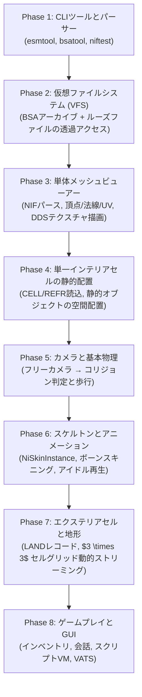

# OpenMW の歴史的実装順序に学ぶ Fallout 3 エンジン開発ロードマップ

## 現在の開発進捗状況 (2026年9月現在)

| フェーズ | クレート | 状態 | 詳細 |
| :--- | :--- | :--- | :--- |
| **Phase 1: ファイル基盤** | `fo3_bsa`, `fo3_vfs` | **100% 完了** | BSA v104 完全解凍、ルーズファイル優先透過読み込み |
| **Phase 2: 3Dメッシュパース** | `fo3_nif` | **100% 完了** | NiNode, BSFadeNode, NiTriShape/Strips, BSShaderPPLightingProperty, BSShaderTextureSet, NiMaterialProperty, NiAlphaProperty |
| **Phase 3: レンダリング** | `fo3_render` | **100% 完了** | wgpu, DDS デコード, 法線マッピング, Blinn-Phong スペキュラ, Glow Map 自己発光, 半透明ソート描画, 地形スプラット |
| **Phase 4: ESM 配置・データ構造** | `fo3_esm` | **100% 完了** | STAT, SCOL, DOOR, ACTI, FURN, CONT, LIGH, CELL, WRLD, LAND, REFR 拡張, ACHR/ACRE 配置アクター |
| **Phase 4-3: 室内・屋外探索** | `fo3_viewer` | **達成済み** | Vault 101 / Megaton / Wasteland をフリーカメラ探索可能 |
| **Phase 5: コリジョンと基本物理** | `fo3_nif` (bhk), `fo3_physics` | **完了** | Rapier3D 物理エンジン統合、FPS 歩行モード、LAND 地形コライダー |
| **Phase 6-A: スキニングランタイム基礎** | `fo3_nif`, `fo3_render` | **着手中** | NiSkinData パース完了、CPU スキニング実装済み（T-Pose 固定） |
| **Phase 6-B: アニメーション再生基盤** | `fo3_nif`, `fo3_render` | 達成済み | NiTimeController, KF キーフレーム補間, アニメーションプレイヤー |
| **Phase 6-C: NPC 配置・表示** | `fo3_viewer` | 未着手 | ACHR → RACE → スケルトン + 防具の組み立て、アイドル再生 |
| **Phase 6-D: 基本インタラクト** | `fo3_viewer` | 未着手 | XTEL ドアテレポート、アクティベーター作動、コンテナ |
| **Phase 6-E: プレイヤー/NPC 基礎システム** | `fo3_viewer` | 未着手 | 簡易 AI（注目）、会話 Stub、プレイヤーアクション |
| **Phase 7: スクリプト VM** | `fo3_gameplay` | 未着手 | SCPT バイトコード VM（限定命令セットから） |
| **Phase 8: HUD + Pip-Boy** | `fo3_gameplay` | 未着手 | 最低限の UI |
| **Phase 9: ワールドストリーミング** | `fo3_world` | 未着手 | $3 \times 3$ セルグリッド動的ロード/アンロード |
| **Phase 10: 本格ゲームプレイ** | `fo3_gameplay` | 未着手 | 戦闘・インベントリ・クエスト |

---

## 詳細フェーズ定義（Phase 6 A〜I）

ユーザー指定の優先順位に従い、スキニング→アニメーション→NPC 配置の順で開発を進める。

### Phase A：スキニングランタイム基礎（最優先・着手中）
**目標**: 静止状態のスキンメッシュ（防具・素体）が正しく変形・表示されること。

| 作業 | 状態 |
| :--- | :--- |
| `NiSkinData` パーサー実装 | **完了** |
| `NiSkinInstance` / `NiSkinPartition` パーサー実装 | **完了** |
| CPU スキニング (`apply_skinning_cpu`) | **完了（T-Pose）** |
| スケルトン NIF の読み込みとボーン階層構築 | **完了（2026-09-07）** |
| ボーン階層構造解き（`bones` → `bone_world_map`) | **完了（2026-09-07）** |
| バインドポーズでのスキンメッシュ表示確認 | 実装中 |
| 静的セル表示が壊れていないこと | **確認済み** |

**成功条件**: 単体の防具 NIF や素体を読み込んで、正しくスキンされた状態で表示できる。

**次のステップ**:
1. ~~スケルトン NIF の読み込みとボーン階層構築~~ → **完了**（`scene.rs` のプレパス `collect_bone_world_transforms` + `trust_from_path` で NiNode/BSFadeNode のワールド変換を `bone_world_map` に事前登録）
2. `NiSkinInstance.skeleton_root` と `bones` の参照先を解決し、ボーン階層とスキンメッシュを紐付け → **完了**（`resolve_bone_world_transforms`）
3. ボーン階層のワールドトランスフォームを計算（Forward Kinematics）→ `bone_world_map` の合成は実装済み。残りは実アセット表示での視覚確認（fo3_viewer）
4. 実アセットでの T-Pose スキニングの視覚確認（fo3_viewer で `meshes\armor\leatherarmor\m\outfitm.nif` を表示）

---

### Phase B：アニメーション再生基盤
**目標**: アイドルアニメーションが再生できる状態にする。

| 作業 | 状態 |
| :--- | :--- |
| KF ファイルのヘッダー・ブロックパース | **完了** |
| `NiTransformInterpolator` / `NiTransformData` パース | **完了** |
| キーフレーム補間（線形・四元数 Slerp） | **完了** |
| スケルトン時間更新ループ | **完了（2026-09-08）** |
| ボーン適用ループ (`apply_pose` → FK → skinning) | **完了（2026-09-08）** |
| 簡易アニメーションプレイヤー（単一ループ） | **完了（2026-09-08）** |
| スキンメッシュをアニメに合わせて変形 | 実装済み（`apply_pose` + `recompute_bone_world_map_with_pose` + `apply_skinning_cpu_with_bones`） |

**次のステップ**:
1. ~~`NiControllerSequence` の `ControlledBlock` からボーン名→インターポレータのマップを構築~~ → **完了**（`AnimationClip::from_kf`）
2. ~~ボーン階層へのアニメーション適用（各フレームでインターポレータを評価し、ボーンのローカル変換を更新）~~ → **完了**（`apply_pose` → `recompute_bone_world_map_with_pose`）
3. ~~スケルトン時間更新ループ + 簡易アニメーションプレイヤー~~ → **完了（2026-09-08）**（`AnimationPlayer`：`update(dt)` で CycleType に応じた LOOP/REVERSE/CLAMP 進行、`seek`、`finished` 検出）
4. `NiBSplineCompTransformInterpolator` の B-Spline 補間実装 → **実装済み**（`sample_bspline_transform_interpolator`、Cox-de Boor 基底）
5. ~~スキンメッシュをアニメーションに合わせて変形~~ → **完了**（`apply_skinning_cpu_with_bones` に動的ボーン行列を渡す）
6. 実アセットでの視覚確認（fo3_viewer に KF 再生を統合して NPC を動かす）→ **次のフェーズ (Phase 6-C)**

---

### Phase C：NPC 配置・表示
**目標**: セル内に NPC が実際に出現し、アイドルで動いている。

---

### Phase D：基本インタラクト
**目標**: 最低限のインタラクションが動く（ドア XTEL、アクティベーター、コンテナ）。

---

### Phase E：プレイヤー/NPC 基礎システム
**目標**: 簡易 AI（注目）、会話 Stub、プレイヤーアクション。

---

---

## 1. OpenMW が辿った実装の軌跡（歴史的経緯の分析）

OpenMW（0.1.0 〜 1.0）の CHANGELOG およびアーキテクチャ進化ログを分析すると、極めて合理的かつ安全な開発順序が浮かび上がります。

### なぜこの順序なのか？（失敗を避けるための鉄則）
1. **なぜ最初は CLI なのか？**:
   ウィンドウ生成や GPU パイプラインを初期段階で持ち込むと、パースエラーなのかシェーダーエラーなのかの切り分けが困難になりトークンと時間を浪費する。
   まずは CLI で純粋にバイナリが 1 バイトの余りもなく正確に読めることをテスト駆動（TDD）で固める。
2. **なぜ VFS が描画の前に必須なのか？**:
   NIF 内のテクスチャ参照（`textures\clutter\streetlights\lamppost01.dds` 等）は、ディスク上のルーズファイルにある場合と、`Fallout - Textures.bsa` 内に圧縮されている場合がある。VFS がないと、メッシュのテクスチャを貼るたびに個別コードが必要になり破綻する。
3. **なぜ「単体メッシュ」→「インテリアセル」なのか？**:
   いきなり広大なメガトンや屋外ワールド（WRLD）を読み込もうとすると、セルストリーミング、ハイトマップ地形（LAND）、オクルージョン、LOD が絡み合いバグが爆発する。
   まず単体 NIF を完璧に描画し、次に「閉じた室内空間（Vault 101 やメガトンの民家などの単一 CELL）」を静的に配置することで、最小限のスコープで世界を構築できる。

---

## 2. Fallout 3 (Gamebryo 2.6) 向け最終開発順序

OpenMW の先人の知恵を Fallout 3 の仕様（Gamebryo 2.6, NIF v20.2.0.7, BSA v104, ESM v0.94）に適用した最終開発順序です。

---

### ステップ 1: アセット基盤と VFS (Virtual File System)
- **1-1. BSA (v104) デシリアライザ (`fo3_bsa`)**:
  - `Data/Fallout - Meshes.bsa`, `Fallout - Textures.bsa` のヘッダー、ディレクトリレコード、ファイルレコードのパース。
  - zlib 圧縮ブロックの解凍とオンデマンド読み出し。
- **1-2. VFS (`fo3_vfs`)**:
  - ルーズファイル（ディスク優先）と BSA アーカイブを統合し、`meshes/...` や `textures/...` のパスから直接ストリームを取得する透過的ファイルリゾルバ。

---

### ステップ 2: NIF (v20.2.0.7) ジオメトリパース完全制覇
- **2-1. コアジオメトリブロックの実装 (`fo3_nif`)**:
  - `NiNode`, `BSFadeNode`
  - `NiTriShape`, `NiTriShapeData`, `NiTriStrips`, `NiTriStripsData`
  - 頂点座標（Vertices）、法線（Normals）、UV座標（TexCoords）、三角形インデックス（Triangles）。
- **2-2. マテリアル・テクスチャブロックの実装**:
  - `BSShaderPPLightingProperty`
  - `BSShaderTextureSet` (ディフューズ、ノーマルマップ等のパス取得)
  - `NiMaterialProperty`, `NiAlphaProperty`
- **2-3. CLI 検証 (`fo3_testbed`)**:
  - 実ゲームの `lamppost01ONOFF.nif` や武器・クラッターの NIF を全ブロック解析し、ジオメトリデータとテクスチャパスが 100% 正常に抽出できることを自動テスト。

---

### ステップ 3: 単体メッシュビューアー (`fo3_viewer`)
- **3-1. wgpu レンダリングパイプライン (`fo3_render_wgpu`)**:
  - ウィンドウ生成（`winit`）と WebGPU コンテキストの初期化。
  - `wgpu` の頂点バッファ・インデックスバッファのセットアップ。
- **3-2. テクスチャローダー**:
  - DDS デコーダ（DXT1, DXT3, DXT5, 非圧縮）を実装し、VFS 経由でテクスチャを GPU へアップロード。
- **3-3. シェーダー実装**:
  - `BSShaderPPLightingProperty` を模したフォン/ブラインフォンシェーダー（ディフューズ + 法線マップ + 簡易スペキュラ）。
- **3-4. 単体メッシュビューアー完成**:
  - CLI 引数で指定した単体 NIF（例: ピストルや標識）をウィンドウに表示し、マウスドラッグで 360度 観察できる。

---

### ステップ 4: ESM パーサーとインテリアセル配置 (`fo3_esm` & `fo3_world`)
- **4-1. ESM/ESP レコードパーサー (`fo3_esm`)**:
  - `Fallout3.esm` のグループ構造（Top Group, Subgroups）とレコードヘッダー（FormID, Flags）のパース。
  - `STAT` (Static Object) レコード: 表示用 NIF モデルパスの取得。
  - `CELL` (Interior Cell) レコード: 室内セル（例: `Vault101a`）の抽出。
  - `REFR` (Reference) レコード: 配置オブジェクトの FormID、ワールド座標（X, Y, Z）、回転（P, Y, R）、スケール。
- **4-2. アリーナ型シーングラフへの展開 (`fo3_gamebryo_scene`)**:
  - 室内セルに含まれる全 `REFR` をインスタンス化し、`NiNode` ツリーを構築。
  - `UpdateDownwardPass` により、ワールド行列を一括計算。
- **4-3. 室内ウォークスルー**:
  - フリーカメラ（WASD + マウス）で、Vault 101 やメガトンの室内セルを自由に飛び回れるようにする。

---

### ステップ 5: キャラクター移動と基本物理（Havok / コリジョン）
- **5-1. NIF 内のコリジョンメッシュ抽出**:
  - `bhkRigidBody`, `bhkBoxShape`, `bhkMoppBvTreeShape`。
- **5-2. 簡易プレイヤーコントローラー**:
  - プレイヤーの足元レイキャスト、接地判定、重力落下、壁衝突判定。
  - 地面に立って室内を歩行可能にする。

---

### ステップ 6: スケルトンとアニメーション
- **6-1. ボーン階層とスキニング (`fo3_gamebryo_anim`)**:
  - `NiSkinInstance`, `NiSkinData`, `NiSkinPartition` のパース。
  - GPU 頂点シェーダーでのボーンマトリクススキニング。
- **6-2. キーフレームアニメーション (`NiTimeController`)**:
  - KF ファイルまたは NIF 内の `NiTransformInterpolator` によるボーン回転・移動のアニメーション再生。

---

### ステップ 7: エクステリアセルと地形（Landscape / Terrain）
- **7-1. `LAND` レコードの解析**:
  - ハイトマップ（頂点高さデータ）、頂点法線、テクスチャ頂点カラー。
- **7-2. 地形レンダリング**:
  - グリッドメッシュの生成とテクスチャブレンド（スプラッティング）。
- **7-3. セルグリッド動的ストリーミング**:
  - プレイヤーの移動に伴う周囲 $3 \times 3$ セルの動的ロード・アンロード。

---

### ステップ 8: ゲームプレイ・スクリプト・GUI
- **8-1. スクリプトエンジン (`SCPT`)**:
  - Fallout 3 のスクリプトバイトコード仮想マシンの実装。
- **8-2. UI システム**:
  - HUD（コンパス、HP/APバー）、ピップボーイ（Pip-Boy 3000）、会話ウィンドウ。
