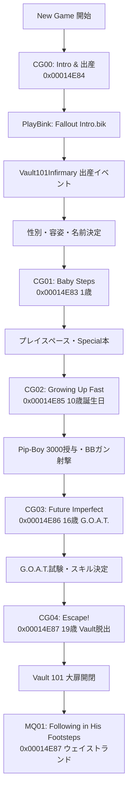

# Fallout 3 実機ニューゲーム・クエスト・スクリプト・イベント駆動エンジン完全仕様書

## 1. 目的と開発方針

本ドキュメントは、Fallout 3 (Gamebryo 2.6) のゲーム開始（ニューゲーム）から Vault 101 脱出に至る全シーケンスを、モックや推測による実装を一切排し、実機 `Fallout3.esm` のデータ定義（`QUST`, `SCPT`, `PACK`, `DIAL`, `INFO`）に基づいて忠実にエミュレートするための設計基準書である。
実装中の機能脱線・簡略化・モック導入を防止するため、全データフローと処理シーケンスを本仕様書に厳格に固定する。

---

## 2. ニューゲームシーケンスの全体フロー (`CG00` 〜 `CG04`, `MQ01`)

実機 Fallout 3 は以下の 5 つの専用キャリブレーションクエスト (`CG` = Character Generation) とメインクエスト第1弾 (`MQ01`) によってシーケンシャルに進行する。



### 2.1. `CG00`: イントロ & 出産 (FormID: `0x00014E84`)
- **セル**: `Vault101Infirmary`
- **登場アクター**:
  - `Player` (生まれたばかりの主人公)
  - `Dad` (James / FormID: `0x00014E88` / Base: `0x00000A61` 等)
  - `Catherine` (母 / FormID: `0x00014E89`)
  - `Doc Mitchell` (医師)
- **スクリプト・演出**:
  - イントロムービー再生: `PlayBink "Fallout Intro.bik"`
  - 画面フェードイン・ブラー（`ApplyImageSpaceModifier`）
  - 父親 James のリップシンク・台詞再生（`Say`）
  - 名前・性別決定 UI（MenuMode 1007: RaceSexMenu）
  - 母親 Catherine の心停止イベント、Dad の移動パッケージ（`Travel`）

### 2.2. `CG01`: Baby Steps (FormID: `0x00014E83`, 1歳)
- **セル**: `Vault101Infirmary` / `Vault101LivingQuarters`
- **モデル**: 幼児スケルトン（`characters\_1stperson\locomotion\toddler\*`）
- **目標 (Objectives)**:
  - `10`: "Walk to Dad." (歩行チュートリアル)
  - `20`: "Open the playpen" (ドア・ゲートのインタラクト)
  - `30`: "Exit the playpen"
  - `40`: "Look at the 'You're SPECIAL' book" (S.P.E.C.I.A.L. ポイント配分メニュー)
  - `50`: "Follow Dad."
- **スクリプト**: S.P.E.C.I.A.L. 本のアクティベート時に `ShowMessage` またはメニュー呼び出し、ステータス確定後に Dad がゲートを開けて誘導。

### 2.3. `CG02`: Growing Up Fast (FormID: `0x00014E85`, 10歳)
- **セル**: `Vault101Cafeteria` / `Vault101LivingQuarters`
- **イベント**:
  - 10歳の誕生日パーティ。Stanley から Pip-Boy 3000（HUD・インベントリ機能解禁）、父親から BB ガンをプレゼントされる。
  - レクリエーションルームでの射撃訓練（ターゲット標的・ラッドローチ退治）。

### 2.4. `CG03`: Future Imperfect (FormID: `0x00014E86`, 16歳)
- **セル**: `Vault101Classroom`
- **イベント**:
  - G.O.A.T. (Generalized Occupational Aptitude Test) 試験。
  - 設問への回答に応じた Tag スキルの初期設定。

### 2.5. `CG04`: Escape! (FormID: `0x00014E87`, 19歳)
- **セル**: `Vault101LivingQuarters` -> `Vault101Atrium` -> `Vault101Entrance`
- **イベント**:
  - Amata（幼馴染）による緊急起こし。「父親が Vault を脱出した」「監督官が怒り狂っている」。
  - 警備員との戦闘、監督官オフィスでの暗証番号取得、Vault 101 大扉（巨大ギア型ドア）の開閉シーケンス。
  - 外部ウェイストランドへの脱出ポータル通過。

---

## 3. エンジンアーキテクチャ設計

実機同様の動作を実現するため、以下の 4 層アーキテクチャを厳格に定義する。

```
+-------------------------------------------------------------+
| 1. Game State & Quest Manager (クエスト状態・ステージ・目標)  |
|    - current_stages, stage_history, objectives_displayed    |
|    - QUST レコード (stages, SCTX, QOBJ, NNAM) の完全保持     |
+-------------------------------------------------------------+
                              |
                              v
+-------------------------------------------------------------+
| 2. Script Execution VM & Interpreter (Bethesda Script)      |
|    - SCDA (コンパイル済みバイトコード) デコーダ              |
|    - SCTX (テキストスクリプト) インタープリタ               |
|    - コマンド: SetStage, AddItem, MoveTo, Say, PlayBink 等  |
+-------------------------------------------------------------+
                              |
                              v
+-------------------------------------------------------------+
| 3. Event Dispatcher & Loop (毎フレームイベント駆動)         |
|    - GameMode (毎フレーム定期実行)                           |
|    - OnActivate, OnEquip, MenuMode                          |
|    - クエストスクリプトおよびアタッチスクリプトの実行       |
+-------------------------------------------------------------+
                              |
                              v
+-------------------------------------------------------------+
| 4. Actor Behavior & AI Package (キャラの自律動作)           |
|    - PACK レコード (Travel, Wander, Sleep, Escort, Follow)  |
|    - EvaluatePackage (evp) による動作計画の動的切替          |
|    - 経路移動 (Pathfinding / Waypoints)                     |
+-------------------------------------------------------------+
```

---

## 4. 厳格なデータ連動ルール (Anti-Speculation Mandate)

1. **モックの完全禁止**:
   - `Unknown Quest` やダミーステージのハードコードを一切禁止する。
   - 必ず `EsmMasterContext` から取得した `QuestRecord` の実機データ（FormID, EditorID, ステージ, スクリプト, 目標テキスト）のみを使用すること。
2. **スクリプトの完全実行**:
   - ステージ遷移（`SetStage`）が発生した場合、該当ステージの `script_source`（`SCTX`）を省略せず、必ずスクリプト VM に渡して実行すること。
   - スクリプト内の `SetObjectiveDisplayed` や `AddItem` 等の副作用を漏れなく世界状態へ適用すること。
3. **フレーム毎のイベントディスパッチ**:
   - メインループで毎フレーム `GameEvent::GameMode` をディスパッチし、アクティブなクエストスクリプトの条件判断とタイマー処理を駆動すること。
